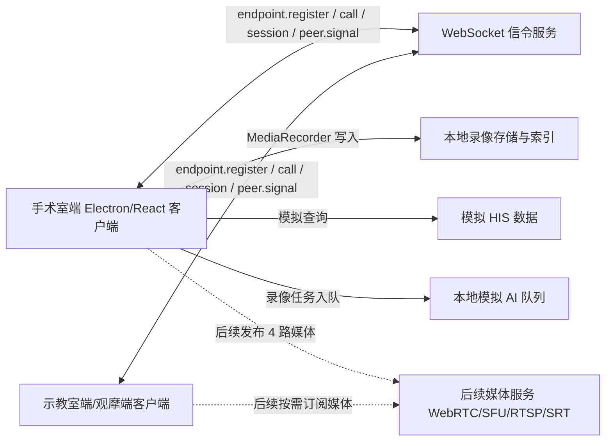

# 软件架构说明

## 一、当前 PoC 架构

## 二、职责划分

| 模块 | 当前职责 | 不承担的职责 |
|---|---|---|
| 前端客户端 | 4 路本地预览、录制、回放、信令控制、患者绑定、AI 队列入口 | 真实跨终端媒体转发 |
| Electron 主进程 | 本地录像文件写入、索引、定位、导出 | HIS、FTP、AI 服务调用 |
| 信令服务 | 注册、在线目录、会话目录、呼叫、会话、订阅、标注、结束、断连清理、`peer.signal` 透传 | 音视频媒体转发、鉴权、持久化 |
| 模拟 HIS | 验证患者绑定流程 | 真实医院系统联网 |
| 模拟 AI 队列 | 验证 AI 任务入口 | 模型推理和医学结论 |

## 三、后续生产化拆分

生产化不应把所有能力塞进手术室端单机进程。建议拆分为：

1. 客户端：手术室端、示教室端、Android 会议平板端、手机直播观看端。
2. 信令服务：控制面、鉴权、会话、通讯录。
3. 媒体服务：WebRTC/SFU、RTSP/SRT 接入、直播分发。
4. 文件服务：录像归档、导出、FTP 或对象存储上传。
5. 集成服务：HIS、PACS、AI 任务、审计。

## 四、当前关键边界

当前 PoC 的 `peer.signal` 只证明 WebRTC 协商消息可以通过信令服务透传，不证明真实远端视频已经可用。真实媒体阶段必须另行验证延迟、码率、同步、丢包恢复、回声消除和多并发能力。
